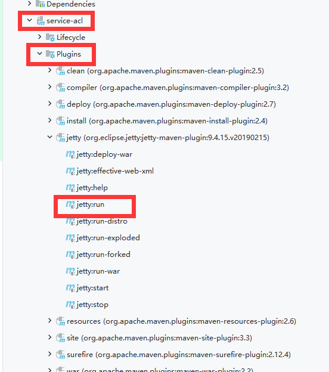

# 项目启动方式
配置好自己的ip在相关配置文件中，例如zookeeper、redis服务
使用的不是tomcat服务器，使用的是jetty。在maven菜单的service或者web中，使用`Plugins`中的jetty:run进行启动。
有三个service服务端、两个web消费端。需要分别进行启动。

# 项目总结:🕊️🕊️🕊️

<h3 style="color:orange">技术不是很熟练，还需练习思考</h3>

尚硅谷的尚好房项目(SSM+Springboot+dubbo)

## 1.一个父项目

shf_parent Maven管理聚合工程，对父项目进行clean、install等操作，会对所有的子项目都继续

这些操作

## 2.二个服务消费者

- web-admin:后台的管理界面（工作人员）视图层（Thymeleaf+Hplus+zTree) +控制层(@Controller @Reference)
- web-front:前台的管理界面（针对客户）视图层(Vue+axios)+控制层（@RestController @Reference)

## 3.三个服务提供者

- service-acl:权限管理(用户管理、角色管理、菜单管理)

- service-house:房屋管理(数据字典、小区管理、房源管理)

- service-user:客户管理（登录、注册、关注房源的三个操作:关注、查看我的关注、取消关注)

## 4.四个开发层次

- 视图层view: Thymeleaf +Hplus+zTree+Vue+axios

- 控制层controller: SpringMVC @Reference (作为服务的消费者，调用远程的Dubbo服务)
- 业务层service: Spring的声明式事务管理 @Service (Dubbo服务)
- 持久层: dao MyBatis

## 5.五个模块

- common-util:工具类、Result
-  model: entity vo
- service-api: Dubbo服务提供者和服务消费者的共同的接口
- service:服务提供者的父项目(三个子模块)
- web:服务消费者的父项目(二个子模块)

## 6.六种技术

- SSM(后台)

- Thymeleaf+Hplus+zTree(前端)
- Vue + axios(前端)
- Dubbo+Zookeeper项目结构由单体架构变成了分布式架构(SOA的架构)(整体架构)
- SpringSecurity + SpringSessioin + Redis + Linux（云服务器）
- 七牛云文件上传技术

